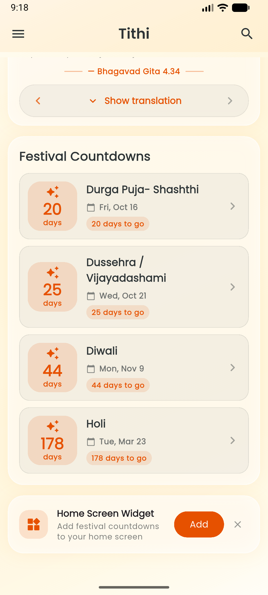
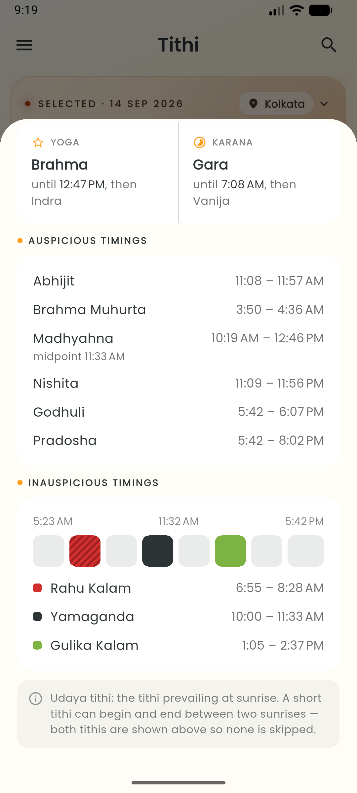
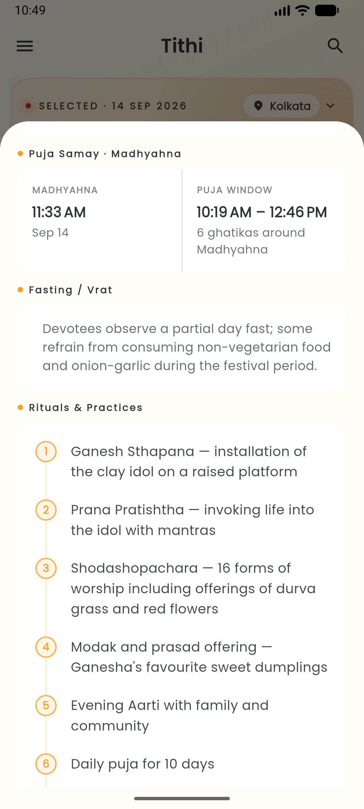

<div align="center">

# 🌙 Tithi — Vedic Calendar App

**A modern, privacy-focused Vedic Calendar (Panchang) app built with Flutter.**
Accurate daily Panchang, moon phases, and festival data — powered entirely by on-device Swiss Ephemeris calculations, with **no Google Play Services required**.

[](https://flutter.dev/)
[](https://dart.dev/)
[](https://riverpod.dev/)
[]()
[]()
[]()

</div>

---

## 📱 Screenshots

<div align="center">

<table>
  <tr>
    <td align="center"><a href="assets/screenshots/Home_Screen.png"><br><sub>Home</sub></a></td>
    <td align="center"><a href="assets/screenshots/Home_Screen_Extend.png"><br><sub>Home (Extended)</sub></a></td>
    <td align="center"><a href="assets/screenshots/Home_Screen_More.png"><br><sub>Home (More)</sub></a></td>
    <td align="center"><a href="assets/screenshots/Paksha_Details.png"><br><sub>Paksha Details</sub></a></td>
  </tr>
  <tr>
    <td align="center"><a href="assets/screenshots/Paksha_Details-Extend.png"><br><sub>Paksha Details (Extended)</sub></a></td>
    <td align="center"><a href="assets/screenshots/Festival_Details.png"><br><sub>Festival Details</sub></a></td>
    <td align="center"><a href="assets/screenshots/Festival_Details_Extend.png"><br><sub>Festival Details (Extended)</sub></a></td>
    <td align="center"><a href="assets/screenshots/App_Sidebar.png"><br><sub>Sidebar</sub></a></td>
  </tr>
</table>

<details>
<summary><strong>More screenshots (Settings, Calendars, Countdowns, Moon Phases, Eclipses, About)</strong></summary>
<br>

<table>
  <tr>
    <td align="center"><a href="assets/screenshots/Settings_Screen.png"><br><sub>Settings</sub></a></td>
    <td align="center"><a href="assets/screenshots/Settings_Screen2.png"><br><sub>Settings (2)</sub></a></td>
    <td align="center"><a href="assets/screenshots/Settings_Screen3.png"><br><sub>Settings (3)</sub></a></td>
    <td align="center"><a href="assets/screenshots/Calenders_Selection.png"><br><sub>Calendar Selection</sub></a></td>
  </tr>
  <tr>
    <td align="center"><a href="assets/screenshots/Festival_Countdowns_Screen.png"><br><sub>Festival Countdowns</sub></a></td>
    <td align="center"><a href="assets/screenshots/Moon_Phases_Screen.png"><br><sub>Moon Phases</sub></a></td>
    <td align="center"><a href="assets/screenshots/Eclipses_Screen.png"><br><sub>Eclipses</sub></a></td>
    <td align="center"><a href="assets/screenshots/About_Screen.png"><br><sub>About</sub></a></td>
  </tr>
</table>

</details>

</div>

---

## 🌟 Key Features

### 📅 Accurate Panchang
- Daily **Tithi, Nakshatra, Yoga, and Karana** derived from the Swiss Ephemeris (Drik-equivalent)
- Tithi transition timings and sunrise/sunset-aware checkpoints (*madhyahna, aparahna, nishita*)

### 🗓️ Dual Calendar Systems
- **Hindu lunisolar**: Amanta & Purnimant month systems, Shaka & Vikram Samvat eras, Adhika intercalary months
- **Bengali**: Bisuddha Siddhanta
- High-performance month-grid swiping between both, side by side

### 🎉 Festival Engine
> 108 festivals defined in [`assets/festivals.json`](assets/festivals.json)

- Countdown screen, in-app search, and event detail sheets with tithi Begins/Ends spans
- Year export to JSON from Settings
- Local festival reminder notifications
- Correct handling of **vriddhi** (extended), **kshaya** (skipped), and dominant-tithi grace cases
- North-Indian and Bengali observances of the same tithi kept as intentional duplicates

### 🔭 Astronomical Visualization
| Feature | Description |
|---|---|
| **Solar System** | Interactive 3D-like view with real-time planetary positions (Graha Gochar) |
| **Moon Phases** | Animated current moon phase, plus a detailed moon view |
| **Eclipses** | Track upcoming Solar and Lunar eclipses |

### 🙏 Spiritual Tools
- **Sankalpa** — create, track, and get reminders for your spiritual intentions and vows
- **Daily Wisdom** — daily Shlokas and quotes with translations
- **Temple Finder** — locate nearby temples with an interactive offline-friendly map

### 🧰 Everyday Utilities
- Weather sheet
- Home-screen widget
- Screenshot/share cards for festivals and shlokas

### 🌐 Localization
`English` · `हिन्दी (Hindi)` · `বাংলা (Bengali)` · `संस्कृतम् (Sanskrit)`

### 🎨 Theme Support
| Theme | Style |
|---|---|
| **Auto** | Automatically switches between Day (Shukla) and Night (Pure Dark) modes |
| **Shukla (Light)** | Vibrant orange and gold aesthetic representing the waxing moon |
| **Pure Dark (Dark)** | OLED-black, gold accents — max readability and battery saving |
| **Krishna (Cyber)** | Deep purple/neon aesthetic representing the waning moon |

### 🔒 FOSS & Privacy First
- ✅ **Offline First** — works completely offline using local Swiss Ephemeris data
- ✅ **No GMS Dependency** — uses Android's native `LocationManager` and OpenStreetMap (Nominatim) for geolocation
- ✅ **Notifications** — daily Tithi and Sankalpa reminders, scheduled locally, no server
- ✅ **Location Aware** — precise calculations for your current city, with a manual "Home Location" picker

---

## 🛠️ Tech Stack

| Layer | Technology |
|---|---|
| Framework | [Flutter](https://flutter.dev/) 3.x / Dart 3.10+ |
| State Management | [Riverpod](https://riverpod.dev/) (`flutter_riverpod`) |
| Local Storage | [Hive](https://pub.dev/packages/hive) + `hive_flutter` (codegen via `build_runner`) |
| Astronomy Engine | [Swiss Ephemeris](https://www.astro.com/swisseph/) via the `jyotish` package (`packages/jyotish`, Dart FFI + native Android bindings; a no-ephemeris web fallback ships limited matching) |
| Calendars / UI | `table_calendar`, `flutter_map` (OpenStreetMap) + tile caching, `lottie`, `google_fonts` |
| Geolocation | [geolocator](https://pub.dev/packages/geolocator) (device GPS) + [nominatim_geocoding](https://pub.dev/packages/nominatim_geocoding) (reverse geocoding) |
| Notifications | [flutter_local_notifications](https://pub.dev/packages/flutter_local_notifications) + `workmanager` (background reminders) |
| Sharing / Export | [share_plus](https://pub.dev/packages/share_plus), `screenshot`, `file_picker` |
| Home Widget | `home_widget` |
| Linting | `flutter_lints` |

---

## 🚀 Getting Started

### Prerequisites

- Flutter SDK 3.x (Dart 3.10 or higher — see `environment` in `pubspec.yaml`)
- Android Studio / VS Code with Flutter extensions
- Android NDK (for compiling the Swiss Ephemeris bindings in `packages/jyotish`)
- A connected device or emulator for full functionality
  > ⚠️ The Windows host has no native ephemeris library, so host-side runs use synthetic data paths and limited matching.

### Installation

```bash
# 1. Clone the repository
git clone https://github.com/1arunjyoti/Tithi-App.git
cd Tithi-App

# 2. Install dependencies
flutter pub get
```

> **Note:** Ensure the Swiss Ephemeris data files (`*.se1`) are present in `assets/ephe/` before running.

### Run the App

```bash
flutter run
flutter run -d <device_id>   # run on a specific device
```

### Release Build (with Auto-Bump)

Use the wrapper script to increment the build number in `pubspec.yaml` and then build the release APK:

```powershell
.\build_release.ps1
```

```bash
flutter build apk --release
flutter build appbundle --release   # Android App Bundle
```

---

## ✅ Tests, Lint & Codegen

```bash
flutter analyze                                                    # static analysis (see analysis_options.yaml)
flutter test                                                       # full host-side suite
flutter test test/festival_data_test.dart                          # one file
flutter test test/display_priority_test.dart                       # same-day ordering + dataset ranks
flutter gen-l10n                                                   # generate localization code from lib/l10n/*.arb
flutter pub run build_runner build --delete-conflicting-outputs    # regen Hive adapters after model changes
```

> [!NOTE]
> - Localization settings are defined in `l10n.yaml`, using `lib/l10n/app_en.arb` as the template. Run `flutter gen-l10n` after editing an ARB file.
> - `test/festivals_rule_test.dart` is **device-only** (initializes the real `PanchangService`; fails on host with `MissingPluginException`) and is intentionally excluded from host runs.
> - Host-side tests cover matching logic with synthetic checkpoints, never real sky positions — true ephemeris behavior needs a device build.

---

## 🎉 Editing Festival Data

Festival rules live in [`assets/festivals.json`](assets/festivals.json) (Amanta months; the app handles Purnimant conversion).

📖 **Full authoring reference:** [docs/FESTIVALS_Modification_GUIDE.md](docs/FESTIVALS_Modification_GUIDE.md) — schema, masa/paksha/tithi rules, Solar and nakshatra festivals, timing overrides, vriddhi/kshaya/grace, same-day `displayPriority` ordering, traps, verification checklist, and pipeline map.

> [!TIP]
> No version bump needed after editing — the repository fingerprints the JSON content and reseeds Hive automatically on next launch.

---

## 📚 More Docs

- [docs/Bisuddha_Siddhanta_Bengali_Calendar_Implementation_Guide.md](docs/Bisuddha_Siddhanta_Bengali_Calendar_Implementation_Guide.md) — Bengali calendar implementation
- [docs/Lunisolar_Shaka_Vikram_Reference.md](docs/Lunisolar_Shaka_Vikram_Reference.md) — Shaka/Vikram era reference
- [packages/jyotish/README.md](packages/jyotish/README.md) + [packages/jyotish/QUICKSTART.md](packages/jyotish/QUICKSTART.md) — native ephemeris bindings

---

## 📁 Project Structure

```bash
lib/
├── main.dart                 # Entry point, app initialization
├── theme/                    # Theme definitions (Shukla / Pure Dark / Krishna Cyber)
├── l10n/                     # Localization (en, hi, bn, sa)
├── models/                   # Data models + Hive adapters (festival, panchang_data, shloka, ...)
├── services/                 # Backend logic
│   ├── panchang/             # Native + web panchang services
│   ├── bengali_calendar/     # Bengali calendar service
│   ├── festival_matching_pipeline.dart  # Shared matching/filter single source of truth
│   ├── festival_repository.dart         # Hive-backed festival store (content-fingerprinted)
│   ├── festival_export_service.dart     # Year export to JSON
│   ├── notification_service.dart        # Local + festival reminders
│   ├── eclipse_service.dart / moon_phase_service.dart / planetary_view_service.dart
│   ├── sankalpa_service.dart / shloka_service.dart / temple_service.dart / weather_service.dart
│   └── share_file/ / panchang_init/     # Platform-channel stubs + implementations
├── providers/                # Riverpod providers (panchang, festivals, countdown, theme, locale, ...)
├── screens/                  # Home, countdown, eclipse, moon phases, solar system, temple map,
│                             # sankalpa/, settings, location picker, about, privacy policy
├── widgets/                  # Calendar, event/tithi detail sheets, search, countdown cards,
│                             # share cards, schedule view, ritual checklist, weather sheet, ...
├── utils/                    # Shared helpers
└── platform/                 # Platform-specific glue
packages/
└── jyotish/                  # Swiss Ephemeris FFI bindings + native Android code (requires NDK)
assets/
├── ephe/                     # Swiss Ephemeris data (*.se1)
├── festivals.json            # 108 festival rules (Amanta)
└── data/ images/ icons/ map_data/
test/                         # Host-side suite (matching, vriddhi, grace, nakshatra, export, ...)
integration_test/             # On-device verification (e.g. Adhika month rows)
docs/                         # Guides (festivals, Bengali calendar, era reference)
```

---

<div align="center">
<sub>Built with 🪔 using Flutter — offline-first, privacy-first.</sub>
</div>