# Tithi - Vedic Calendar App

**Tithi** is a modern, privacy-focused Vedic Calendar (Panchang) application built with Flutter. It provides accurate daily Panchang data, moon phases, and festival information based on your precise location, all without relying on Google Play Services.

Calendars supported: Hindu lunisolar (Amanta and Purnimant month systems, Shaka and Vikram Samvat eras, Adhika intercalary months) and the Bengali calendar (Bisuddha Siddhanta).

## 📱 Screenshots

<p align="center"><strong>A glimpse of Tithi's Panchang, calendar, festival, and settings screens.</strong></p>

<table>
  <tr>
    <td align="center"><a href="assets/screenshots/Home_Screen.png">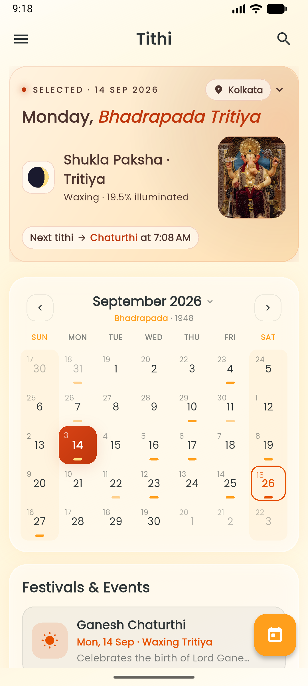</a></td>
    <td align="center"><a href="assets/screenshots/Home_Screen_Extend.png">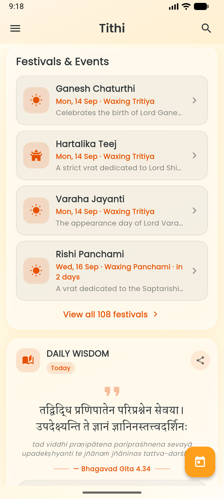</a></td>
    <td align="center"><a href="assets/screenshots/Paksha_Details.png">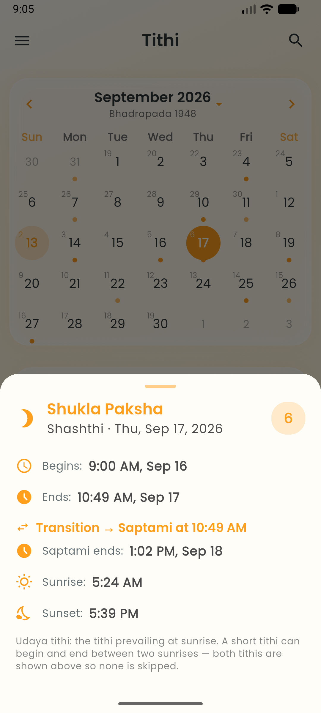</a></td>
    <td align="center"><a href="assets/screenshots/Festival_Details.png">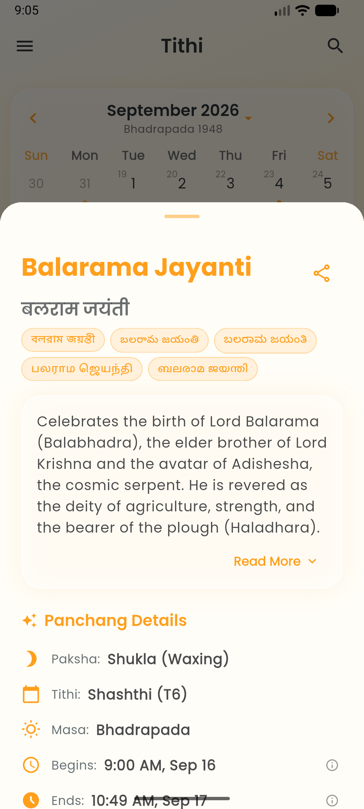</a></td>
  </tr>
  <tr>
    <td align="center"><a href="assets/screenshots/App_Sidebar.png">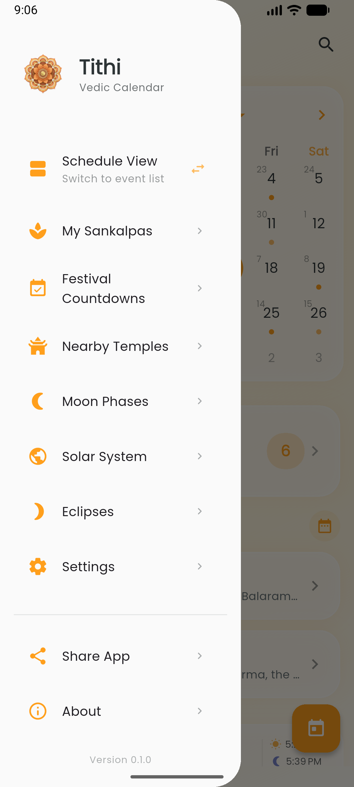</a></td>
    <td align="center"><a href="assets/screenshots/Settings_Screen.png">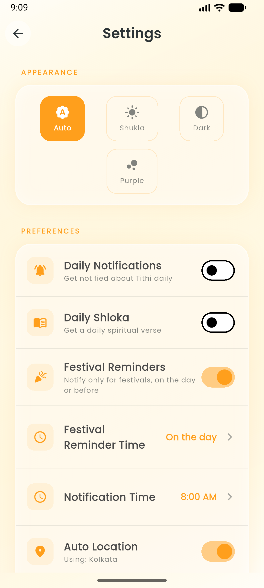</a></td>
    <td align="center"><a href="assets/screenshots/Settings_Screen2.png">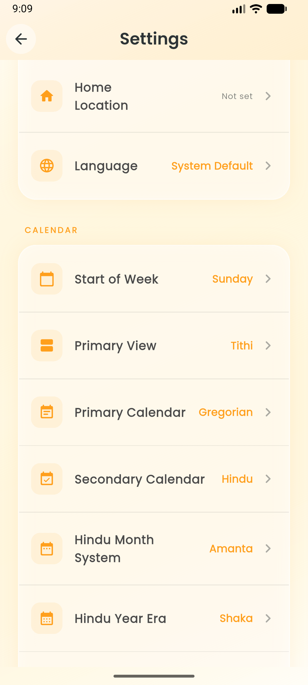</a></td>
    <td align="center"><a href="assets/screenshots/Settings_Screen3.png">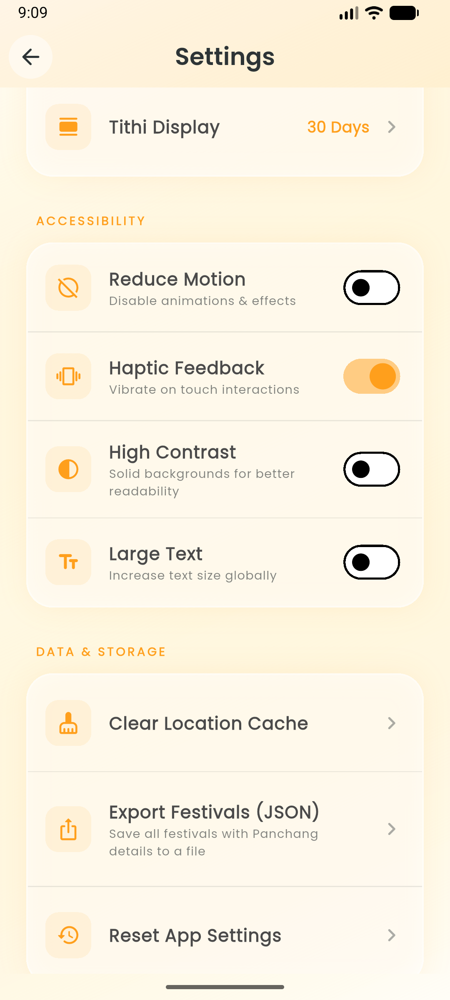</a></td>
  </tr>
  <tr>
    <td align="center"><a href="assets/screenshots/Calenders_Selection.png">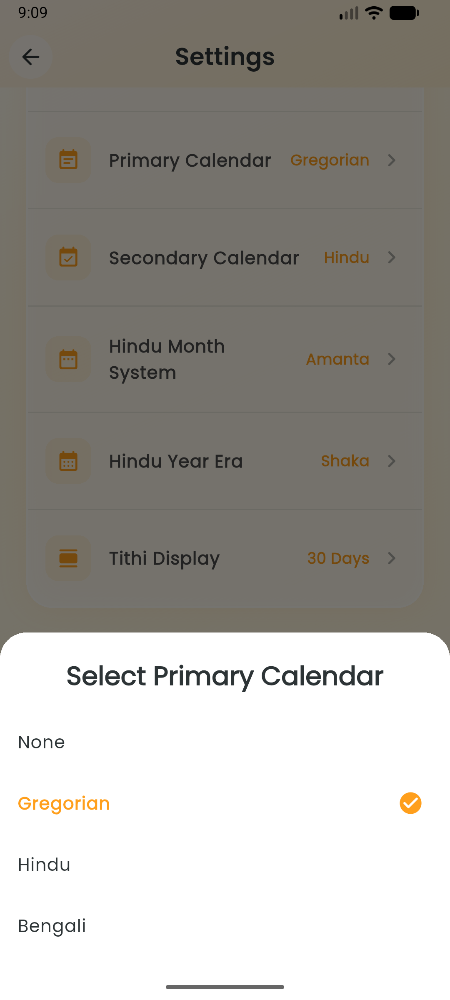</a></td>
    <td align="center"><a href="assets/screenshots/Festival_Countdowns_Screen.png">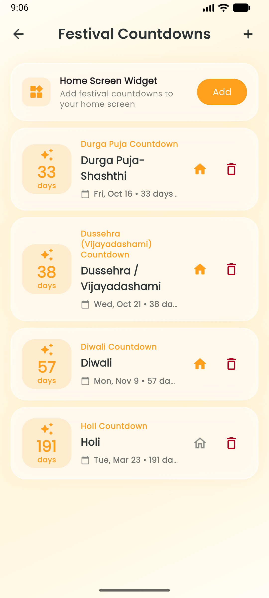</a></td>
    <td align="center"><a href="assets/screenshots/Moon_Phases_Screen.png">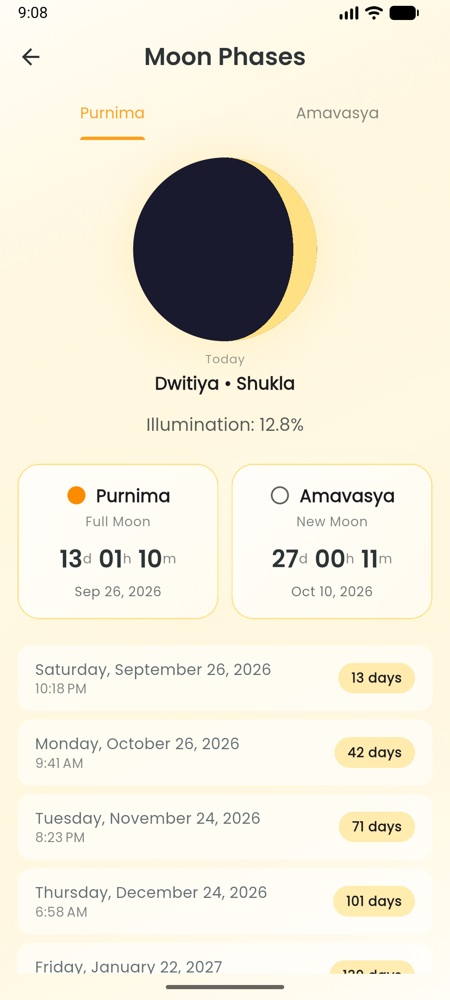</a></td>
    <td align="center"><a href="assets/screenshots/Eclipses_Screen.png">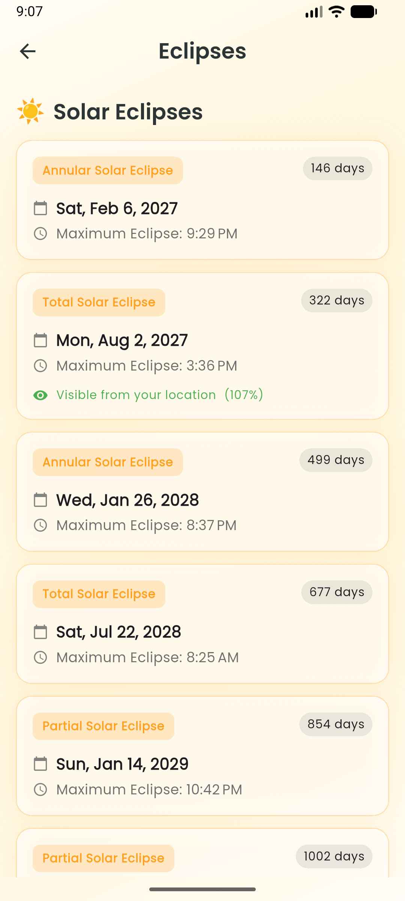</a></td>
  </tr>
  <tr>
    <td align="center"><a href="assets/screenshots/About_Screen.png">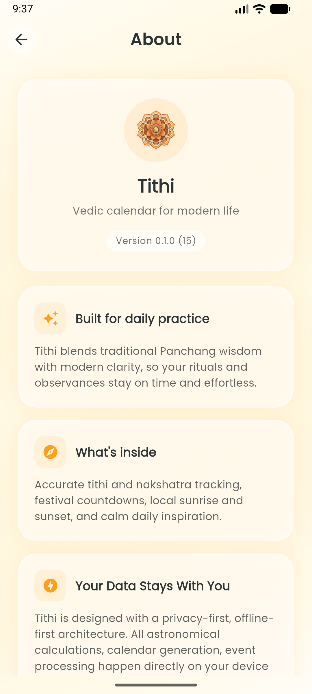</a></td>
  </tr>
</table>

## 🌟 Key Features

- **Accurate Panchang**: Daily Tithi, Nakshatra, Yoga, and Karana derived from the Swiss Ephemeris (Drik-equivalent), with tithi transition timings and sunrise/sunset-aware checkpoints (madhyahna, aparahna, nishita).
- **Dual Calendar Systems**: Hindu (Amanta/Purnimant, Shaka/Vikram eras) and Bengali (Bisuddha Siddhanta) side by side, with high-performance month-grid swiping.
- **Festival Engine** (108 festivals in `assets/festivals.json`):
  - Countdown screen, in-app search, and event detail sheets with tithi Begins/Ends spans.
  - Year export to JSON from Settings.
  - Local festival reminder notifications.
  - Correct handling of vriddhi (extended), kshaya (skipped), and dominant-tithi grace cases, plus North-Indian and Bengali observances of the same tithi kept as intentional duplicates.
- **Astronomical Visualization**:
  - **Solar System**: Interactive 3D-like view with real-time planetary positions (Graha Gochar).
  - **Moon Phases**: Beautiful, animated representation of the current moon phase, plus a detailed moon view.
  - **Eclipses**: Track upcoming Solar and Lunar eclipses.
- **Spiritual Tools**:
  - **Sankalpa**: Create, track, and get reminders for your spiritual intentions and vows.
  - **Daily Wisdom**: Daily Shlokas and quotes with translations.
  - **Temple Finder**: Locate nearby temples with an interactive offline-friendly map.
- **Everyday Utilities**: Weather sheet, home-screen widget, screenshot/share cards for festivals and shlokas.
- **Localization**: English, Hindi (हिन्दी), Bengali (বাংলা), and Sanskrit (संस्कृतम्).
- **Theme Support**:
  - **Auto**: Automatically switches between Day (Shukla) and Night (Pure Dark) modes.
  - **Shukla (Light)**: Vibrant orange and gold aesthetic representing the waxing moon.
  - **Pure Dark (Dark)**: Professional, OLED-black dark mode with gold accents for maximum readability and battery saving.
  - **Krishna (Cyber)**: Unique deep purple/neon aesthetic representing the waning moon.
- **FOSS & Privacy First**:
  - **Offline First**: Works completely offline using local Swiss Ephemeris data.
  - **No GMS Dependency**: Uses Android's native `LocationManager` and `OpenStreetMap` (Nominatim) for geolocation.
- **Notifications**: Daily Tithi and Sankalpa reminders scheduled locally (no server).
- **Location Aware**: Precise calculations for your current city, with a manual "Home Location" picker.

## 🛠️ Tech Stack

- **Framework**: [Flutter](https://flutter.dev/) 3.x / Dart 3.10+
- **State Management**: [Riverpod](https://riverpod.dev/) (`flutter_riverpod`)
- **Local Storage**: [Hive](https://pub.dev/packages/hive) + `hive_flutter` (codegen via `build_runner`)
- **Astronomy Engine**: [Swiss Ephemeris](https://www.astro.com/swisseph/) via the `jyotish` package (`packages/jyotish`, Dart FFI + native Android bindings; a no-ephemeris web fallback ships limited matching)
- **Calendars/UI**: `table_calendar`, `flutter_map` (OpenStreetMap) + tile caching, `lottie`, `google_fonts`
- **Geolocation**: [geolocator](https://pub.dev/packages/geolocator) (device GPS) + [nominatim_geocoding](https://pub.dev/packages/nominatim_geocoding) (reverse geocoding)
- **Notifications**: [flutter_local_notifications](https://pub.dev/packages/flutter_local_notifications) + `workmanager` (background reminders)
- **Sharing/Export**: [share_plus](https://pub.dev/packages/share_plus), `screenshot`, `file_picker`
- **Home Widget**: `home_widget`
- **Linting**: `flutter_lints`

## 🚀 Getting Started

### Prerequisites

- Flutter SDK 3.x (Dart 3.10 or higher — see `environment` in `pubspec.yaml`)
- Android Studio / VS Code with Flutter extensions
- Android NDK (for compiling the Swiss Ephemeris bindings in `packages/jyotish`)
- A connected device or emulator for full functionality (the Windows host has no native ephemeris library, so host-side runs use synthetic data paths and limited matching)

### Installation

1. **Clone the repository**:

   ```bash
   git clone https://github.com/1arunjyoti/Tithi-App.git
   cd Tithi-App
   ```

2. **Install Dependencies**:

   ```bash
   flutter pub get
   ```

3. **Prepare Assets**:
   Ensure the Swiss Ephemeris data files (`*.se1`) are present in `assets/ephe/`.

4. **Run the App**:

   ```bash
   flutter run
   flutter run -d <device_id>   # run on a specific device
   ```

### Release Build With Auto-Bump

Use the wrapper script to increment the build number in `pubspec.yaml` and then build the release APK:

```powershell
.\build_release.ps1
```

```bash
flutter build apk --release
flutter build appbundle --release   # Android App Bundle
```

## ✅ Tests, Lint & Codegen

```bash
flutter analyze                        # static analysis (see analysis_options.yaml)
flutter test                           # full host-side suite
flutter test test/festival_data_test.dart          # one file
flutter test test/display_priority_test.dart       # same-day ordering + dataset ranks
flutter gen-l10n                              # generate localization code from lib/l10n/*.arb
flutter pub run build_runner build --delete-conflicting-outputs  # regen Hive adapters after model changes
```

Notes:

- Localization settings are defined in `l10n.yaml`, using `lib/l10n/app_en.arb` as the template. Run `flutter gen-l10n` after editing an ARB file.
- `test/festivals_rule_test.dart` is device-only (initializes the real `PanchangService`; fails on host with `MissingPluginException`) and is intentionally excluded from host runs.
- Host-side tests cover matching logic with synthetic checkpoints, never real sky positions — true ephemeris behavior needs a device build.

## 🎉 Editing Festival Data

Festival rules live in `assets/festivals.json` (Amanta months; the app handles Purnimant conversion). Full authoring reference:

- **[docs/FESTIVALS_Modification_GUIDE.md](docs/FESTIVALS_Modification_GUIDE.md)** — schema, masa/paksha/tithi rules, Solar and nakshatra festivals, timing overrides, vriddhi/kshaya/grace, same-day `displayPriority` ordering, traps, verification checklist, and pipeline map.

No version bump needed after editing: the repository fingerprints the JSON content and reseeds Hive automatically on next launch.

## 📚 More Docs

- [docs/Bisuddha_Siddhanta_Bengali_Calendar_Implementation_Guide.md](docs/Bisuddha_Siddhanta_Bengali_Calendar_Implementation_Guide.md) — Bengali calendar implementation
- [docs/Lunisolar_Shaka_Vikram_Reference.md](docs/Lunisolar_Shaka_Vikram_Reference.md) — Shaka/Vikram era reference
- [packages/jyotish/README.md](packages/jyotish/README.md) + [packages/jyotish/QUICKSTART.md](packages/jyotish/QUICKSTART.md) — native ephemeris bindings

## 📁 Project Structure

```bash
lib/
├── main.dart                 # Entry point, app initialization
├── theme/                    # Theme definitions (Shukla / Pure Dark / Krishna Cyber)
├── l10n/                     # Localization (en, hi, bn, sa)
├── models/                   # Data models + Hive adapters (festival, panchang_data, shloka, ...)
├── services/                 # Backend logic
│   ├── panchang/             # Native + web panchang services
│   ├── bengali_calendar/     # Bengali calendar service
│   ├── festival_matching_pipeline.dart  # Shared matching/filter single source of truth
│   ├── festival_repository.dart         # Hive-backed festival store (content-fingerprinted)
│   ├── festival_export_service.dart     # Year export to JSON
│   ├── notification_service.dart        # Local + festival reminders
│   ├── eclipse_service.dart / moon_phase_service.dart / planetary_view_service.dart
│   ├── sankalpa_service.dart / shloka_service.dart / temple_service.dart / weather_service.dart
│   └── share_file/ / panchang_init/     # Platform-channel stubs + implementations
├── providers/                # Riverpod providers (panchang, festivals, countdown, theme, locale, ...)
├── screens/                  # Home, countdown, eclipse, moon phases, solar system, temple map,
│                             # sankalpa/, settings, location picker, about, privacy policy
├── widgets/                  # Calendar, event/tithi detail sheets, search, countdown cards,
│                             # share cards, schedule view, ritual checklist, weather sheet, ...
├── utils/                    # Shared helpers
└── platform/                 # Platform-specific glue
packages/
└── jyotish/                  # Swiss Ephemeris FFI bindings + native Android code (requires NDK)
assets/
├── ephe/                     # Swiss Ephemeris data (*.se1)
├── festivals.json            # 108 festival rules (Amanta)
└── data/ images/ icons/ map_data/
test/                         # Host-side suite (matching, vriddhi, grace, nakshatra, export, ...)
integration_test/             # On-device verification (e.g. Adhika month rows)
docs/                         # Guides (festivals, Bengali calendar, era reference)
```
